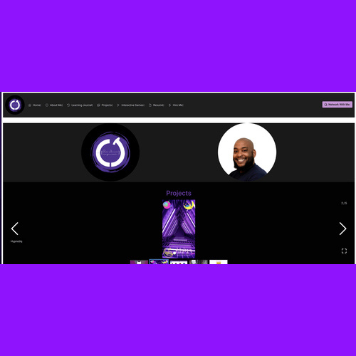
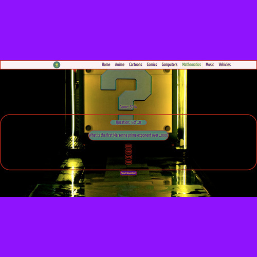
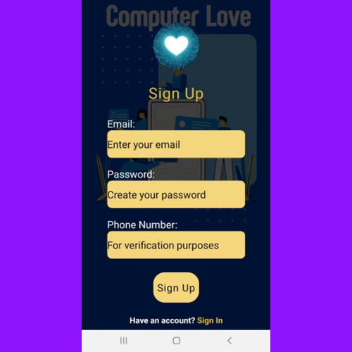

# Portfolio Website - Designed & Constructed by CJ Jones

<!-- Header -->

<!-- Technologies Used -->
 

# Technologies Used

  
<h3>Frameworks, Languages, & Tools</h3>
  
   
    
   
   
   
  

   
   

<!-- View Here -->

# My Portfolio In Action

  <h3>Personal Website</h3>
 
This portfolio is my personal portfolio website and should work in all modern browsers.

 
View  Here

 
      

 
 
<!-- Projects -->

# My Featured Projects

<h3> Personal Projects</h3>
 <table style="width: 100%">
   <tr>
          <td style="width: 50%; vertical-align: top">
            <h3 align="center" color="white">See Jones Engineer</h3>
            

              
                
              

                
                
              

              

                <strong
                  >Javascript, React, PrimeReact, Three.js, HTML5, CSS3</strong
                >
              

              

                I developed a fully responsive mobile-first portfolio website to
                showcase my UX/UI talents and personal projects. The website
                features a user-friendly platform that allows users to browse my
                works and reach out to schedule meetings or work. The
                technologies used to design and construct the website's
                front-end were carefully chosen to ensure a responsive,
                efficient, and intuitive UI/UX. I integrated JavaScript, React,
                PrimeReact, and Three.js to create an interactive and visually
                appealing website that engages users and meets their needs.
              

            

          </td>
          <td style="width: 50%; vertical-align: top">
            <h3 align="center" color="white">Hypnotiq 2.0</h3>
            

              
                
              

                
                
              

              

                <strong>React Native, Expo, Firebase, Cloud Firestore</strong>
              

              

                Hypnotiq 2.0 is a music player app that allows users to create,
                edit and delete music playlists, load music from their local
                device storage, and stream audio to help with sleep and study
                patterns. The app uses the latest industry technologies such as
                Javascript, React, CSS, Firebase, and Cloud Firestore to provide
                seamless audio playback and allow users complete control. In
                future iterations, the database design will be restructured to
                optimize functionality, and the app will include new features
                such as the ability to share playlists with others, comment on
                shared playlists, and direct message other users for admins and
                artists whose work has been shared.
              

            

          </td>
        </tr>
        <tr>
          <td style="width: 50%; vertical-align: top">
            <h3 align="center" color="white">IYKYK</h3>
            

              
                
              

                
                
              

              
<strong>TypeScript, React, HTML5, CSS3, Three.js</strong>

              

                IYKYK is a multiple choice quiz game where users can choose
                their quiz category preferences from a menu of options.
                Questions and answers are aggregated from an external API then
                formatted to meet the game's design. For the front-end of IYKYK,
                I used TypeScript, React, HTML5, CSS3, and Three.js
                to create visually appealing 3D animations and rendering. The
                game's navigation bar will be updated to include multi-nested
                menus and submenus, and the stretch goals include adding
                additional quiz topics and types, diversifying the categories,
                and implementing true/false questions. One of the main
                challenges I faced was learning the intricacies
                of TypeScript, but the syntactical sugar provided by TypeScript
                was extremely helpful in debugging. Overall, IYKYK was created
                as an experiment to enhance my understanding of
                TypeScript, 3D animations, and rendering.
              

            

          </td>
          <td style="width: 50%; vertical-align: top">
            <h3 align="center" color="white">Computer Love</h3>
            

              
                
              

                
                
              

              

                <strong
                  >React Native Expo, Redux, Express, PostgreSQL,
                  Node.js</strong
                >
              

              

                Computer Love is a mobile dating/networking application for
                users in the tech industry. The MVP allows users to
                register/login and swipe yes or no to dating/networking based on
                their preferences. The back-end is built with Node.js,
                PostgreSQL, Sequelize, and Express. Stretch goals include
                allowing users to deactivate/reactivate their accounts and
                report inappropriate behavior. Future plans include adding
                multiple photos and location-based matching. One of the main
                challenges was integrating the front-end with the back-end and
                designing/implementing the user matching/swiping logic.
              

            

          </td>
        </tr>
      </table>

 
 

<!-- Footer -->

